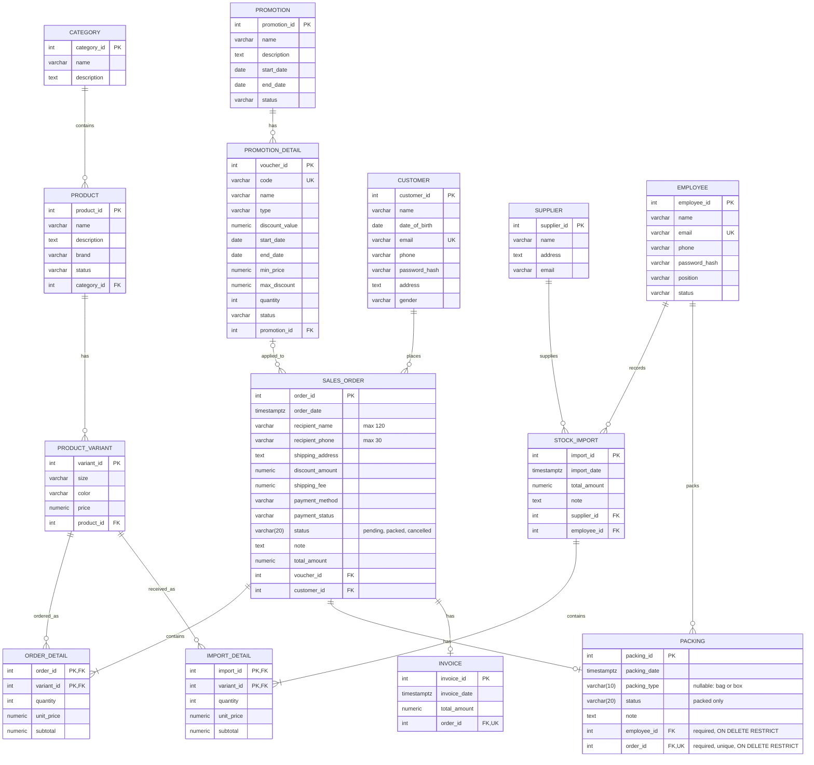

# Sales system ERD (corrected)

This Mermaid diagram is the editable, current model. The adjacent PNG is retained as a historical reference only and is not the current ERD; it includes outdated `Packing.weight` and `packing_fee` fields that are outside the approved MVP. Physical `sales_order` replaces the ambiguous/reserved table name `Order` in PostgreSQL.

## Constraints and purchase/order/packing rules

- `ORDER_DETAIL` uses `(order_id, variant_id)` as its primary key; `IMPORT_DETAIL` uses `(import_id, variant_id)`. Each variant occurs once in a document's detail rows.
- `SALES_ORDER.status` is `pending`, `packed`, or `cancelled`; customer cancellation is permitted only while `pending`, and the employee packing action transitions directly from `pending` to `packed`.
- An order has zero or one packing row and zero or one invoice row while being processed. Each packing/invoice row belongs to exactly one order; the required unique `packing.order_id` FK enforces at most one packing row per order. Each packing row also references exactly one required employee; one employee may pack many orders.
- MVP packing records the server timestamp, `packed` status, required employee, and optional note; packaging type is nullable and restricted to `bag` or `box`. The order-to-packing relationship is one-to-zero-or-one. It does not require package weight or a packing fee. `SALES_ORDER.shipping_fee` remains a separate delivery charge.
- Voucher codes and employee/customer emails are unique. `INVOICE.total_amount` is an immutable issue-time amount snapshot; payment method/status remain on `SALES_ORDER`, so the duplicate invoice method is removed.
- `IMPORT_DETAIL.quantity` and `ORDER_DETAIL.quantity` are document/order quantities only. They are not combined into an available-stock balance, and this schema does not track inventory movements or balances.
- Creating an import records its supplier, employee, variants, quantities, and prices as purchase history; it does not replenish a computed stock balance. Creating an order validates active products and variant references but does not check available stock. Cancelling a pending order changes its status only and does not restore or otherwise change stock.
