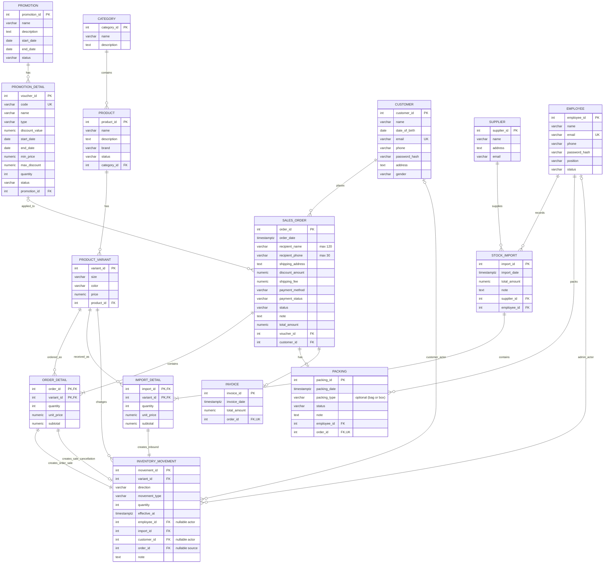

# Sales system ERD (corrected)

This Mermaid diagram is the editable, corrected model. The adjacent PNG is retained as the originally supplied image. Physical `sales_order` replaces the ambiguous/reserved table name `Order` in PostgreSQL.

## Constraints and stock rules

- `ORDER_DETAIL` uses `(order_id, variant_id)` as its primary key; `IMPORT_DETAIL` uses `(import_id, variant_id)`. Each variant occurs once in a document's detail rows.
- An order has zero or one packing row and zero or one invoice row while being processed; each packing/invoice row belongs to exactly one order (`order_id` is unique in both tables).
- MVP packing records the packing date, status, employee, and note; packaging type (such as a bag or box) is optional. It does not require package weight or a packing fee. `SALES_ORDER.shipping_fee` remains a separate delivery charge.
- Voucher codes and employee/customer emails are unique. `INVOICE.total_amount` is an immutable issue-time amount snapshot; payment method/status remain on `SALES_ORDER`, so the duplicate invoice method is removed.
- `INVENTORY_MOVEMENT` is an append-only quantity ledger. `direction` is `in` or `out`; `movement_type` is `opening`, `import`, `sale`, `sale_cancellation`, or `adjustment`. Opening, import, and sale cancellation are inbound; a sale is outbound when the order is placed; adjustments can be either. Opening quantity may be zero; other movement quantities are positive integers.
- Each new movement has exactly one actor: employee for opening, import, and adjustment movements; customer for order sale and cancellation movements. The employee/customer actor columns are nullable because only one applies to a given row. Legacy employee-attributed sale rows without an order source are grandfathered; new order-linked sale rows use a customer actor.
- Import movements have a unique FK to the source `(import_id, variant_id)` detail. Each order detail is the source of its sale movement and may also be the source of one optional cancellation movement, both through `(order_id, variant_id)`. Opening and adjustment movements have no source document.
- Order placement and its outbound sale movements are atomic. Pending orders already have outbound ledger history; cancelling a pending order appends compensating inbound movements and changes its status to cancelled, so cancelled orders retain both movements. At period start, beginning stock is the net of all earlier movements. Period ending stock is `beginning + inbound - outbound`.
