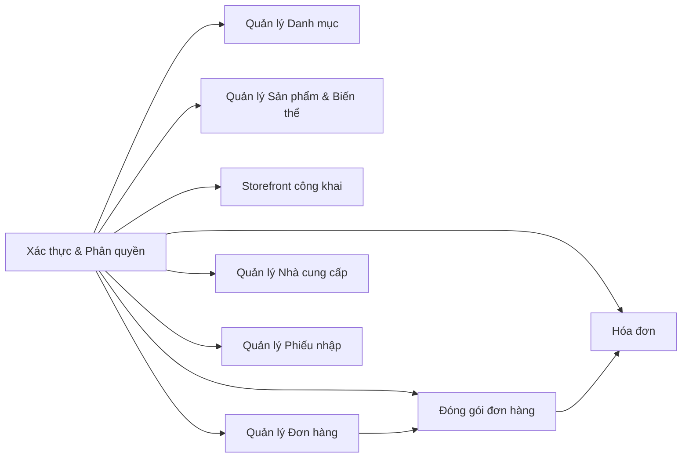
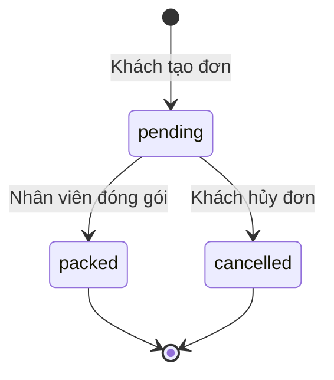

# Đặc tả yêu cầu chức năng (Functional Requirements)

## Hệ thống bán hàng trực tuyến

| Thông tin        | Chi tiết                                         |
| ---------------- | ------------------------------------------------ |
| **Dự án**        | Hệ thống bán hàng trực tuyến                     |
| **Phiên bản**    | 1.0 – MVP                                        |
| **Ngày tạo**     | 29/09/2026                                       |
| **Tech Stack**   | NestJS 11, TypeScript, PostgreSQL, TypeORM, JWT   |

---

## 1. Tổng quan hệ thống

Hệ thống bán hàng trực tuyến cho phép:

- **Khách hàng**: đăng ký tài khoản, duyệt sản phẩm, đặt hàng và quản lý đơn hàng cá nhân.
- **Nhân viên**: thao tác theo vai trò `admin` hoặc `manager`.

### 1.1. Các tác nhân (Actors)

| Tác nhân        | Mô tả                                                                 |
| --------------- | ---------------------------------------------------------------------- |
| **Khách vãng lai** | Người truy cập chưa đăng nhập; chỉ xem storefront công khai.        |
| **Khách hàng**  | Người dùng đã đăng ký/đăng nhập; đặt hàng, xem và hủy đơn hàng.     |
| **Nhân viên**   | Tài khoản vận hành được phân vai trò; `admin` quản trị nhân viên và được phép qua mọi API nội bộ. |

### 1.2. Sơ đồ tổng quan các module

---

## 2. Nhóm chức năng: Xác thực & Phân quyền (Authentication & Authorization)

### FR-AUTH-01: Đăng nhập nhân viên

| Thuộc tính     | Mô tả |
| -------------- | ----- |
| **Mô tả**      | Nhân viên đăng nhập bằng email và mật khẩu để nhận JWT. |
| **Tác nhân**    | Nhân viên |
| **Điều kiện tiên quyết** | Tài khoản nhân viên đã tồn tại và có `status = active`. |
| **Luồng chính** | 1. Nhân viên gửi `POST /auth/employee/login` với `email` và `password`. 2. Hệ thống xác minh email tồn tại, mật khẩu đúng, trạng thái `active`. 3. Trả JWT Bearer token có thời hạn 15 phút. |
| **Luồng ngoại lệ** | – Email/mật khẩu sai → `401 Unauthorized`. – Nhân viên bị khóa (`status ≠ active`) → `401 Unauthorized`. |
| **Kết quả**     | Nhân viên nhận `access_token`, `token_type`, `expires_in` và hồ sơ gồm `employeeId`, `name`, `email`, `position`, `role`. Vai trò được đọc từ database khi xác thực request, không tin role trong JWT. |

### FR-AUTH-02: Đăng ký khách hàng

| Thuộc tính     | Mô tả |
| -------------- | ----- |
| **Mô tả**      | Khách hàng tạo tài khoản mới. |
| **Tác nhân**    | Khách vãng lai |
| **Điều kiện tiên quyết** | Email chưa được sử dụng. |
| **Luồng chính** | 1. Gửi `POST /auth/customer/register` với `email`, `password`, `name`. 2. Tùy chọn: `dateOfBirth` (YYYY-MM-DD), `phone`, `address`, `gender`. 3. Mật khẩu hợp lệ: 12–128 ký tự; email được trim và chuyển lowercase. 4. Hệ thống tạo tài khoản, trả JWT và thông tin khách hàng. |
| **Luồng ngoại lệ** | – Email đã tồn tại → `409 Conflict`. – Mật khẩu không đủ dài → `400 Bad Request`. |
| **Kết quả**     | Khách nhận `access_token` và thông tin hồ sơ (`customerId`, `name`, `email`, `dateOfBirth`, `phone`, `address`, `gender`). |

### FR-AUTH-03: Đăng nhập khách hàng

| Thuộc tính     | Mô tả |
| -------------- | ----- |
| **Mô tả**      | Khách hàng đăng nhập bằng email và mật khẩu. |
| **Tác nhân**    | Khách hàng |
| **Luồng chính** | 1. Gửi `POST /auth/customer/login` với `email` và `password`. 2. Xác minh thông tin hợp lệ. 3. Trả JWT và thông tin khách hàng. |
| **Luồng ngoại lệ** | – Sai thông tin → `401 Unauthorized`. |
| **Kết quả**     | Nhận `access_token`, `token_type`, `expires_in`, `customer`. |

### FR-AUTH-04: Xem hồ sơ khách hàng

| Thuộc tính     | Mô tả |
| -------------- | ----- |
| **Mô tả**      | Khách hàng xem thông tin hồ sơ cá nhân. |
| **Tác nhân**    | Khách hàng (đã đăng nhập) |
| **Luồng chính** | 1. Gửi `GET /auth/customer/profile` với Bearer token. 2. Trả thông tin hồ sơ. |
| **Kết quả**     | Trả `customerId`, `name`, `email`, `dateOfBirth`, `phone`, `address`, `gender`. |

### FR-AUTH-05: Cập nhật hồ sơ khách hàng

| Thuộc tính     | Mô tả |
| -------------- | ----- |
| **Mô tả**      | Khách hàng cập nhật thông tin cá nhân (trừ email và mật khẩu). |
| **Tác nhân**    | Khách hàng (đã đăng nhập) |
| **Luồng chính** | 1. Gửi `PATCH /auth/customer/profile` với các trường cần sửa: `name`, `dateOfBirth`, `phone`, `address`, `gender`. 2. Bỏ trường → giữ nguyên; gửi `null` → xóa giá trị (trường cho phép null). |
| **Ràng buộc**   | Không thể cập nhật `email` và `password` qua API này. |
| **Kết quả**     | Trả hồ sơ đã cập nhật. |

### FR-AUTH-06: Xem hồ sơ nhân viên

| Thuộc tính     | Mô tả |
| -------------- | ----- |
| **Mô tả**      | Nhân viên xem thông tin cá nhân từ token. |
| **Tác nhân**    | Nhân viên (đã đăng nhập) |
| **Luồng chính** | 1. Gửi `GET /auth/employee/profile` với Bearer token. |
| **Kết quả**     | Trả hồ sơ nhân viên gồm `employeeId`, `name`, `email`, `position`, `role`. |

### FR-AUTH-07: Phân biệt loại token

| Thuộc tính     | Mô tả |
| -------------- | ----- |
| **Mô tả**      | JWT có phân biệt loại chủ thể (nhân viên / khách hàng). |
| **Quy tắc**     | – Customer token không truy cập API nhân viên; employee token không truy cập API khách hàng. – Thiếu/sai/hết hạn token, sai loại actor hoặc nhân viên inactive → `401 Unauthorized`. – Nhân viên active nhưng thiếu vai trò bắt buộc → `403 Forbidden`. |

### Chính sách vai trò nhân viên

`position` là chức danh mô tả, không cấp quyền. API nạp `role` hiện tại từ database ở mỗi request. `admin` được phép trên tất cả API nhân viên, gồm quản lý nhân viên. `manager` được phép dùng toàn bộ API vận hành nhưng không quản lý nhân viên. Khi migration nâng cấp role, các role vận hành cũ được gom thành `manager`; tài khoản `unassigned` cũ cũng thành `manager`, nhưng tài khoản đang active được khóa để admin rà soát và kích hoạt lại.

| Vai trò | API nội bộ được phép |
| --- | --- |
| `admin` | Tất cả API nhân viên, bao gồm quản lý tài khoản nhân viên. |
| `manager` | `/categories`, `/products`, biến thể, `/promotions`, `/admin/orders`, xác nhận COD, tra cứu biên nhận, `/suppliers` và `/imports`. |

### FR-AUTH-08: Quản lý tài khoản và vai trò nhân viên

| Thuộc tính | Mô tả |
| --- | --- |
| **Tác nhân** | Nhân viên có `role = admin`. |
| **Endpoint** | `GET /admin/employees?page=1&limit=20`, `POST /admin/employees`, `PATCH /admin/employees/:employeeId`. |
| **Quy tắc** | `GET` liệt kê có phân trang giới hạn và chỉ trả trường hồ sơ an toàn; `POST` tạo tài khoản active, chuẩn hóa email, băm mật khẩu và yêu cầu role hợp lệ; `PATCH` chỉ cập nhật role/status. Không trả `passwordHash`. Không cho admin tự hạ quyền/vô hiệu hóa tài khoản hoặc hạ quyền/vô hiệu hóa admin active cuối cùng. |
| **Phân quyền** | Chỉ admin. Thiếu/sai token hoặc nhân viên inactive trả `401`; actor active không phải admin trả `403`. |

---

## 3. Nhóm chức năng: Quản lý Danh mục (Category Management)

> **Phân quyền**: `manager` hoặc `admin`; active employee thiếu quyền trả `403`.

### FR-CAT-01: Xem danh sách danh mục

| Thuộc tính     | Mô tả |
| -------------- | ----- |
| **Mô tả**      | Liệt kê tất cả danh mục trong hệ thống. |
| **Endpoint**    | `GET /categories` |
| **Kết quả**     | Danh sách các danh mục gồm `categoryId`, `name`, `description`. |

### FR-CAT-02: Xem chi tiết danh mục

| Thuộc tính     | Mô tả |
| -------------- | ----- |
| **Mô tả**      | Xem thông tin chi tiết của một danh mục. |
| **Endpoint**    | `GET /categories/:categoryId` |
| **Luồng ngoại lệ** | – ID không tồn tại → `404 Not Found`. |

### FR-CAT-03: Tạo danh mục

| Thuộc tính     | Mô tả |
| -------------- | ----- |
| **Mô tả**      | Tạo danh mục sản phẩm mới. |
| **Endpoint**    | `POST /categories` |
| **Dữ liệu đầu vào** | `name` (bắt buộc), `description` (tùy chọn). |
| **Kết quả**     | Danh mục mới được tạo và trả về. |

### FR-CAT-04: Cập nhật danh mục

| Thuộc tính     | Mô tả |
| -------------- | ----- |
| **Mô tả**      | Sửa tên hoặc mô tả danh mục. |
| **Endpoint**    | `PATCH /categories/:categoryId` |
| **Dữ liệu đầu vào** | `name` và/hoặc `description`. |

### FR-CAT-05: Xóa danh mục

| Thuộc tính     | Mô tả |
| -------------- | ----- |
| **Mô tả**      | Xóa danh mục khỏi hệ thống. |
| **Endpoint**    | `DELETE /categories/:categoryId` |
| **Luồng ngoại lệ** | – Danh mục có sản phẩm tham chiếu → `409 Conflict`. |

---

## 4. Nhóm chức năng: Quản lý Sản phẩm & Biến thể (Product & Variant Management)

> **Phân quyền**: `manager` hoặc `admin`; active employee thiếu quyền trả `403`.

### FR-PRD-01: Xem danh sách sản phẩm

| Thuộc tính     | Mô tả |
| -------------- | ----- |
| **Endpoint**    | `GET /products` |
| **Kết quả**     | Danh sách sản phẩm gồm `productId`, `name`, `description`, `brand`, `status`, `categoryId`, `images[]` (theo `sortOrder`, rồi `productImageId`). Mỗi ảnh gồm `productImageId`, `productId`, `imageUrl`, `altText`, `sortOrder`, `isPrimary`. |

### FR-PRD-02: Xem chi tiết sản phẩm

| Thuộc tính     | Mô tả |
| -------------- | ----- |
| **Endpoint**    | `GET /products/:productId` |
| **Kết quả**     | Chi tiết sản phẩm gồm các thuộc tính sản phẩm và danh mục cùng `images[]` sắp theo `sortOrder`, rồi `productImageId`. |
| **Luồng ngoại lệ** | – Không tồn tại → `404`. |

### FR-PRD-03: Tạo sản phẩm

| Thuộc tính     | Mô tả |
| -------------- | ----- |
| **Endpoint**    | `POST /products` |
| **Dữ liệu đầu vào** | `name` (bắt buộc), `categoryId` (bắt buộc), `description`, `brand`, `status`, `images[]` (tùy chọn). Ảnh gồm `imageUrl` HTTPS (bắt buộc), `altText` tối đa 200 ký tự, `sortOrder` là số nguyên không âm (mặc định theo vị trí trong mảng), `isPrimary`. Tối đa 12 ảnh; tối đa một ảnh chính. Nếu không đánh dấu ảnh chính, chọn ảnh có `sortOrder` thấp nhất; nếu hòa, chọn ảnh đứng trước trong mảng. |

### FR-PRD-04: Cập nhật sản phẩm

| Thuộc tính     | Mô tả |
| -------------- | ----- |
| **Endpoint**    | `PATCH /products/:productId` |
| **Quy tắc**     | Bỏ qua `images` để giữ ảnh hiện tại; gửi mảng để thay toàn bộ ảnh; gửi `[]` để xóa tất cả. Thay sản phẩm và ảnh là một thao tác nguyên tử. |

### FR-PRD-05: Xóa sản phẩm

| Thuộc tính     | Mô tả |
| -------------- | ----- |
| **Endpoint**    | `DELETE /products/:productId` |
| **Luồng ngoại lệ** | – Sản phẩm còn biến thể → từ chối xóa. |

### FR-PRD-06: Xem biến thể của sản phẩm

| Thuộc tính     | Mô tả |
| -------------- | ----- |
| **Endpoint**    | `GET /products/:productId/variants` |
| **Kết quả**     | Danh sách biến thể gồm `variantId`, `size`, `color`, `price`, `productId`. |

### FR-PRD-07: Thêm biến thể

| Thuộc tính     | Mô tả |
| -------------- | ----- |
| **Endpoint**    | `POST /products/:productId/variants` |
| **Dữ liệu đầu vào** | `price` (bắt buộc), `size` (tùy chọn), `color` (tùy chọn). |

### FR-PRD-08: Cập nhật biến thể

| Thuộc tính     | Mô tả |
| -------------- | ----- |
| **Endpoint**    | `PATCH /products/:productId/variants/:variantId` |

### FR-PRD-09: Xóa biến thể

| Thuộc tính     | Mô tả |
| -------------- | ----- |
| **Endpoint**    | `DELETE /products/:productId/variants/:variantId` |

---

## 5. Nhóm chức năng: Storefront công khai (Public Storefront)

> **Phân quyền**: Không yêu cầu đăng nhập. Chỉ đọc dữ liệu.

### FR-STR-01: Xem danh mục storefront

| Thuộc tính     | Mô tả |
| -------------- | ----- |
| **Mô tả**      | Liệt kê các danh mục có ít nhất một sản phẩm `active`. |
| **Endpoint**    | `GET /store/categories` |

### FR-STR-02: Tìm kiếm & duyệt sản phẩm

| Thuộc tính     | Mô tả |
| -------------- | ----- |
| **Mô tả**      | Lọc sản phẩm active theo từ khóa, danh mục với phân trang. |
| **Endpoint**    | `GET /store/products` |
| **Tham số**     | `page` (mặc định 1), `limit` (mặc định 20, tối đa 100), `q` (tìm theo tên/brand/mô tả, không phân biệt hoa thường), `categoryId`. |
| **Kết quả**     | `{ items, page, limit, total }`. Mỗi item gồm thông tin sản phẩm, danh mục, `priceFrom` (giá biến thể thấp nhất) và `primaryImageUrl` (URL ảnh chính hoặc `null`). |

### FR-STR-03: Xem chi tiết sản phẩm storefront

| Thuộc tính     | Mô tả |
| -------------- | ----- |
| **Mô tả**      | Xem chi tiết sản phẩm active, danh mục, tất cả biến thể và danh sách ảnh theo thứ tự `sortOrder`, rồi `productImageId`. |
| **Endpoint**    | `GET /store/products/:productId` |
| **Luồng ngoại lệ** | – Sản phẩm không active hoặc không tồn tại → `404`. |
| **Ghi chú**     | API storefront không trả số tồn kho. Hệ thống không theo dõi tồn kho. |

---

## 6. Nhóm chức năng: Quản lý Đơn hàng – Khách hàng (Customer Orders)

> **Phân quyền**: Yêu cầu customer JWT. Khách chỉ thao tác trên đơn của mình.

### FR-ORD-01: Tạo đơn hàng

| Thuộc tính     | Mô tả |
| -------------- | ----- |
| **Mô tả**      | Khách đặt đơn hàng mới với 1–100 biến thể khác nhau. |
| **Endpoint**    | `POST /orders` |
| **Dữ liệu đầu vào** | `recipientName` (tối đa 120 ký tự, bắt buộc), `recipientPhone` (tối đa 30 ký tự, bắt buộc), `shippingAddress` (bắt buộc, phải còn nội dung sau trim), `note`, `voucherCode`, `paymentMethod` (tùy chọn), `details[]` gồm `variantId` và `quantity` (nguyên dương). |
| **Quy tắc nghiệp vụ** | – Server lấy `customerId` từ JWT, kiểm tra sản phẩm active và biến thể hợp lệ. – Server tự tính giá dòng, tổng hàng, voucher và tổng đơn; client không được ghi đè các giá trị tài chính hoặc trạng thái. – `paymentMethod` nhận `cod` hoặc `payos`, mặc định `cod`; đơn mới có `shippingFee = "0.00"`, `status = "pending"`. – COD bắt đầu `paymentStatus = "unpaid"`; PayOS tổng bằng 0 được tự xác nhận đã thanh toán, PayOS tổng dương bắt đầu unpaid và cần `Idempotency-Key`. – Tạo đơn, chi tiết, lượt voucher và payment attempt (nếu có) trong cùng quy trình transaction; hệ thống không kiểm tra/trừ tồn kho. |
| **Kết quả**     | Trả đơn hàng gồm `orderId`, `orderDate`, thông tin giao hàng, voucher, tài chính, phương thức/trạng thái thanh toán, `status`, `details[]`; đơn PayOS chờ thanh toán có thể kèm `checkoutUrl` và `paymentExpiresAt`. |

### FR-ORD-02: Xem danh sách đơn hàng

| Thuộc tính     | Mô tả |
| -------------- | ----- |
| **Mô tả**      | Liệt kê đơn hàng của khách hiện tại, mới nhất trước. |
| **Endpoint**    | `GET /orders?page=1&limit=20` |
| **Tham số**     | `page` (≥ 1), `limit` (1–100). |
| **Kết quả**     | `{ items, page, limit, total }`. Items không gồm `details`. |

### FR-ORD-03: Xem chi tiết đơn hàng

| Thuộc tính     | Mô tả |
| -------------- | ----- |
| **Endpoint**    | `GET /orders/:orderId` |
| **Luồng ngoại lệ** | – Đơn không tồn tại hoặc thuộc khách khác → `404`. |
| **Kết quả**     | Đơn hàng đầy đủ kèm `details[]` sắp theo `variantId`. |

### FR-ORD-04: Hủy đơn hàng

| Thuộc tính     | Mô tả |
| -------------- | ----- |
| **Mô tả**      | Khách hủy đơn đang `pending`. |
| **Endpoint**    | `POST /orders/:orderId/cancel` |
| **Quy tắc nghiệp vụ** | – Chỉ hủy được đơn `pending`; đơn đã `packed` hoặc `cancelled` → `409 Conflict`. – COD được hủy trực tiếp. Với PayOS, chỉ hủy và trả lượt voucher sau khi provider xác nhận link kết thúc, chưa thu tiền và số tiền khớp. – Nếu PayOS đang xử lý, đã thu một phần, hoặc chưa thể đối chiếu thì giữ đơn `pending` để admin rà soát và tiếp tục giữ lượt voucher. – Hủy không ảnh hưởng tồn kho vì hệ thống không theo dõi tồn kho. |
| **Kết quả**     | Đơn hàng với `status = "cancelled"` và chi tiết đơn. |

---

## 7. Nhóm chức năng: Quản trị Đơn hàng – Nhân viên (Admin Order Management)

> **Phân quyền**: `manager` hoặc `admin`; active employee thiếu quyền trả `403`.

### FR-ADM-01: Xem danh sách đơn hàng (admin)

| Thuộc tính     | Mô tả |
| -------------- | ----- |
| **Mô tả**      | Nhân viên xem tất cả đơn hàng, sắp xếp mới nhất trước. |
| **Endpoint**    | `GET /admin/orders?page=1&limit=20&status=pending` |
| **Tham số**     | `page` (mặc định 1, ≥ 1), `limit` (mặc định 20, 1–100), `status` (tùy chọn: `pending`, `packed`, `cancelled`). |
| **Kết quả**     | `{ items, page, limit, total }`. Mỗi item gồm `orderId`, `orderDate`, `customerId`, `recipientName`, `status`, `paymentStatus`, `totalAmount`, `detailCount`. Không gồm địa chỉ hay dòng hàng. |

### FR-ADM-02: Xem chi tiết đơn hàng (admin)

| Thuộc tính     | Mô tả |
| -------------- | ----- |
| **Endpoint**    | `GET /admin/orders/:orderId` |
| **Kết quả**     | Đầy đủ thông tin đơn gồm `details[]` (mỗi dòng có `productName`, `size`, `color`, `quantity`, `unitPrice`, `subtotal`) và `packing` (null nếu chưa đóng gói, hoặc object gồm `packingId`, `packingDate`, `packingType`, `status`, `note`, `employeeId`). |

### FR-ADM-03: Đóng gói đơn hàng

| Thuộc tính     | Mô tả |
| -------------- | ----- |
| **Mô tả**      | Nhân viên đóng gói đơn hàng, chuyển trạng thái từ `pending` → `packed`. |
| **Endpoint**    | `POST /admin/orders/:orderId/pack` |
| **Dữ liệu đầu vào** | `packingType` (tùy chọn: `"bag"` hoặc `"box"`), `note` (tùy chọn, tối đa 1000 ký tự). |
| **Quy tắc nghiệp vụ** | – Chỉ đóng gói đơn `pending`; đơn `packed`/`cancelled` → `409 Conflict`. Đơn PayOS phải được xác nhận thanh toán trước khi đóng gói. – Sử dụng pessimistic write lock trên `sales_order` để tuần tự hóa với thao tác hủy. – Server lấy `employeeId` từ JWT, thời gian từ server. – Tạo bản ghi `packing`, chuyển đơn sang `packed` trong cùng transaction; MVP không lưu cân nặng. |
| **Kết quả**     | Đơn hàng đã cập nhật kèm thông tin `packing`. |

### FR-ADM-04: Xác nhận đã thu tiền COD

| Thuộc tính     | Mô tả |
| -------------- | ----- |
| **Endpoint**    | `POST /admin/orders/:orderId/mark-paid` |
| **Quy tắc nghiệp vụ** | Chỉ `manager` hoặc `admin` được xác nhận đơn COD đang `packed` và `unpaid`, sau khi đã nhận đủ tiền. PayOS không được xác nhận qua endpoint này. Đơn pending/cancelled, đã thanh toán hoặc PayOS → `409 Conflict`. Cập nhật thanh toán và phát hành hóa đơn trong cùng transaction. |
| **Kết quả**     | Đơn trả `paymentStatus = "paid"`, thời gian và nhân viên xác nhận. |

---

## 8. Nhóm chức năng: Quản lý Nhà cung cấp (Supplier Management)

> **Phân quyền**: `manager` hoặc `admin`; active employee thiếu quyền trả `403`.

### FR-SUP-01: Xem danh sách nhà cung cấp

| Thuộc tính     | Mô tả |
| -------------- | ----- |
| **Endpoint**    | `GET /suppliers` |

### FR-SUP-02: Xem chi tiết nhà cung cấp

| Thuộc tính     | Mô tả |
| -------------- | ----- |
| **Endpoint**    | `GET /suppliers/:supplierId` |

### FR-SUP-03: Tạo nhà cung cấp

| Thuộc tính     | Mô tả |
| -------------- | ----- |
| **Endpoint**    | `POST /suppliers` |
| **Dữ liệu đầu vào** | `name` (bắt buộc), `address` (tùy chọn), `email` (tùy chọn). |

### FR-SUP-04: Cập nhật nhà cung cấp

| Thuộc tính     | Mô tả |
| -------------- | ----- |
| **Endpoint**    | `PATCH /suppliers/:supplierId` |

### FR-SUP-05: Xóa nhà cung cấp

| Thuộc tính     | Mô tả |
| -------------- | ----- |
| **Endpoint**    | `DELETE /suppliers/:supplierId` |
| **Luồng ngoại lệ** | – Nhà cung cấp có phiếu nhập tham chiếu → `409 Conflict`. |

---

## 9. Nhóm chức năng: Quản lý Phiếu nhập (Stock Import Management)

> **Phân quyền**: `manager` hoặc `admin`; active employee thiếu quyền trả `403`.

### FR-IMP-01: Xem danh sách phiếu nhập

| Thuộc tính     | Mô tả |
| -------------- | ----- |
| **Endpoint**    | `GET /imports` |

### FR-IMP-02: Xem chi tiết phiếu nhập

| Thuộc tính     | Mô tả |
| -------------- | ----- |
| **Endpoint**    | `GET /imports/:importId` |
| **Kết quả**     | Phiếu nhập gồm `importId`, `importDate`, `totalAmount`, `note`, `supplierId`, `employeeId`, `details[]`. |

### FR-IMP-03: Tạo phiếu nhập

| Thuộc tính     | Mô tả |
| -------------- | ----- |
| **Mô tả**      | Nhân viên tạo phiếu nhập hàng từ nhà cung cấp. |
| **Endpoint**    | `POST /imports` |
| **Dữ liệu đầu vào** | `supplierId` (bắt buộc), `note` (tùy chọn), `details[]` gồm 1–100 dòng: `variantId`, `quantity` (nguyên dương), `unitPrice` (chuỗi thập phân, tối đa 2 chữ số thập phân). |
| **Quy tắc nghiệp vụ** | – `employeeId` lấy từ JWT. – Server tính `subtotal` và `totalAmount`. – Lưu phiếu và chi tiết trong cùng transaction. – Phiếu nhập chỉ là lịch sử chứng từ; KHÔNG tăng tồn kho khả dụng. – Không thể sửa hoặc xóa phiếu nhập sau khi tạo. |
| **Kết quả**     | Phiếu nhập đã tạo với đầy đủ chi tiết. |

---

## 10. Nhóm chức năng: Hóa đơn (Invoice)

### FR-INV-01: Phát hành và xem hóa đơn

| Thuộc tính     | Mô tả |
| -------------- | ----- |
| **Mô tả**      | Hệ thống phát hành một hóa đơn khi đơn được xác nhận đã thanh toán và cho phép chủ đơn/nhân viên tra cứu. |
| **Endpoint**    | `GET /orders/:orderId/invoice` (customer JWT); `GET /admin/orders/:orderId/invoice` (`manager` hoặc `admin`). |
| **Quy tắc nghiệp vụ** | – Hóa đơn được phát hành cùng transaction xác nhận đơn paid: COD qua `POST /admin/orders/:orderId/mark-paid`; PayOS sau webhook/đối soát xác nhận đủ tiền; đơn PayOS tổng 0 được phát hành ngay. – Chưa thanh toán hoặc chỉ mới đóng gói thì chưa có hóa đơn; route trả `404`. – Mỗi đơn tối đa một hóa đơn; `totalAmount` là snapshot bất biến tại thời điểm phát hành, trạng thái hiện tại là `issued`. – Khách chỉ xem hóa đơn của đơn mình; đơn/hóa đơn không tồn tại hoặc thuộc khách khác đều trả `404`. Nhân viên chỉ xem qua route admin khi có `manager` hoặc `admin`. |
| **Kết quả**     | `{ invoiceId, orderId, issuedDate, totalAmount, status }`. |

---

## 11. Nhóm chức năng: Khuyến mãi & Voucher (Promotion)

### FR-PRM-01: Quản lý chương trình khuyến mãi

| Thuộc tính     | Mô tả |
| -------------- | ----- |
| **Mô tả**      | `manager` hoặc `admin` tạo, xem, cập nhật chương trình qua `GET/POST /promotions`, `GET/PATCH /promotions/:promotionId`. Chưa có xóa; chuyển `status` sang `inactive` để ngừng dùng. |
| **Dữ liệu**    | `promotionId`, `name`, `description`, `startDate`, `endDate`, `status`. |
| **Quy tắc nghiệp vụ** | Tên tối đa 120 ký tự, mô tả tùy chọn tối đa 5000 ký tự; ngày theo `YYYY-MM-DD`, start không sau end; status `active`/`inactive`, mặc định `active`. |

### FR-PRM-02: Quản lý voucher/mã giảm giá

| Thuộc tính     | Mô tả |
| -------------- | ----- |
| **Mô tả**      | `manager` hoặc `admin` quản lý voucher theo campaign qua `GET/POST /promotions/:promotionId/vouchers` và `GET/PATCH /promotions/:promotionId/vouchers/:voucherId`. Chưa có xóa hoặc sửa code. |
| **Dữ liệu**    | `voucherId`, `code` (unique), `name`, `type`, `discountValue`, `startDate`, `endDate`, `minPrice`, `maxDiscount`, `quantity`, `status`, `promotionId`. |
| **Quan hệ**     | Voucher có thể áp dụng cho đơn hàng qua `SALES_ORDER.voucher_id`. |
| **Quy tắc nghiệp vụ** | Code được trim/chuyển uppercase, chỉ nhận ASCII chữ/số/`-`/`_`, duy nhất toàn hệ thống; type là `fixed` hoặc `percentage`. Campaign và voucher đều phải active và còn hiệu lực ngày hiện tại. `minPrice` tính trên tổng hàng trước giảm; percentage làm tròn half-up tới cent, có thể giới hạn bởi `maxDiscount`; giảm không vượt tổng hàng. `quantity` là lượt dùng chung toàn hệ thống, không giới hạn theo khách. |
| **Quy tắc giữ lượt** | Đơn `pending`/`packed` tính vào lượt dùng; đơn COD pending bị hủy sẽ trả lượt. PayOS chỉ trả lượt sau khi provider xác nhận link cuối cùng, chưa thu tiền và số tiền khớp; tình huống chưa rõ/đã thu một phần giữ đơn và lượt cho admin rà soát. Tạo đơn kiểm tra và giữ lượt nguyên tử để tránh vượt quantity đồng thời. Voucher sai, hết lượt, ngoài hiệu lực hoặc không đạt minPrice trả `400`; code trùng hoặc hạ quantity thấp hơn lượt đang giữ trả `409`. |

### FR-PAY-01: Thanh toán PayOS

| Thuộc tính     | Mô tả |
| -------------- | ----- |
| **Khởi tạo**    | `POST /orders` với customer JWT, `paymentMethod: "payos"` và `Idempotency-Key`. |
| **Quy tắc nghiệp vụ** | Server tính số tiền sau voucher. PayOS nhận VND nguyên dương; tổng có phần lẻ VND trả `400`, không làm tròn. Tổng bằng 0 được đánh dấu paid ngay, không gọi provider. Link thanh toán hết hạn sau 15 phút. Chỉ webhook có chữ ký hợp lệ và đối chiếu server-to-server xác nhận paid; URL return/cancel không chứng minh thanh toán. |
| **Webhook**     | `POST /payments/payos/webhook` công khai, không yêu cầu JWT. Callback được xác minh chữ ký trước xử lý; chỉ trạng thái `PAID` khớp order code, link ID, tổng cần thu và số tiền đã nhận đầy đủ mới chuyển đơn sang paid. |
| **Hết hạn/không rõ kết quả** | Sau 15 phút, chỉ hủy đơn và trả lượt voucher khi provider xác nhận link ở trạng thái cuối, chưa thu tiền và số tiền khớp. Timeout, partial payment, thiếu checkout URL hoặc trạng thái không rõ giữ đơn pending/lượt voucher và yêu cầu admin rà soát. Idempotency key lặp cùng payload tiếp tục cùng đơn; key trùng payload khác trả `409`. |
| **Xác nhận thủ công** | Nhân viên không thể dùng `mark-paid` để xác nhận PayOS; PayOS chỉ chuyển paid qua webhook/đối soát. |

---

## 12. Quy tắc nghiệp vụ chung (Business Rules)

### BR-01: Trạng thái đơn hàng

| Trạng thái    | Mô tả                                                         |
| ------------- | -------------------------------------------------------------- |
| `pending`     | Đơn mới tạo, chờ xử lý. Khách có thể hủy.                    |
| `packed`      | Nhân viên đã đóng gói. Không thể hủy.                         |
| `cancelled`   | Khách đã hủy. Không thể thao tác thêm.                        |

### BR-02: Tồn kho

- Hệ thống **KHÔNG** theo dõi số lượng tồn kho khả dụng.
- Phiếu nhập chỉ ghi nhận lịch sử chứng từ mua hàng.
- Đặt hàng không kiểm tra số lượng còn lại.
- Hủy đơn không khôi phục tồn kho.

### BR-03: Tính toán giá và tiền

- `unitPrice` được lấy từ biến thể tại thời điểm tạo đơn/phiếu nhập.
- `subtotal = quantity × unitPrice` (tính phía server).
- `totalAmount = Σ subtotal - discountAmount + shippingFee` (tính phía server; `shippingFee` hiện bằng `0.00`).
- Tất cả số tiền là chuỗi thập phân có đúng 2 chữ số sau dấu chấm (ví dụ: `"12500.00"`).

### BR-04: Khóa dữ liệu (Unique Constraints)

| Trường                       | Ràng buộc     |
| ---------------------------- | ------------- |
| `CUSTOMER.email`             | Unique        |
| `EMPLOYEE.email`             | Unique        |
| `PROMOTION_DETAIL.code`      | Unique        |
| `PACKING.order_id`           | Unique (1:1)  |
| `INVOICE.order_id`           | Unique (1:1)  |
| `ORDER_DETAIL(order_id, variant_id)` | Composite PK |
| `IMPORT_DETAIL(import_id, variant_id)` | Composite PK |

### BR-05: Đồng thời & An toàn dữ liệu

- Đóng gói và hủy đơn sử dụng **pessimistic write lock** trên dòng `sales_order`.
- Hai thao tác trên cùng đơn được tuần tự hóa; chỉ một thao tác hợp lệ được commit.
- Tạo đơn hàng, tạo phiếu nhập, đóng gói đều thực hiện trong **database transaction**.

### BR-06: Định dạng dữ liệu API

| Kiểu dữ liệu | Định dạng                                    |
| ------------- | -------------------------------------------- |
| ID, số lượng  | JSON integer                                  |
| Tiền          | Chuỗi thập phân 2 chữ số (ví dụ: `"150.00"`) |
| Thời gian     | Chuỗi ISO 8601 UTC                            |
| Nullable      | JSON `null`                                    |

---

## 13. Ma trận phân quyền (Authorization Matrix)

| Chức năng | Khách vãng lai | Khách hàng | `admin` | `manager` |
| --- | :---: | :---: | :---: | :---: |
| Xem storefront | ✅ | ✅ | ✅ | ✅ |
| Đăng ký/đăng nhập khách | ✅ | ❌ | ❌ | ❌ |
| Xem/cập nhật hồ sơ khách | ❌ | ✅ | ❌ | ❌ |
| Tạo đơn hàng | ❌ | ✅ | ❌ | ❌ |
| Xem/hủy đơn cá nhân | ❌ | ✅ | ❌ | ❌ |
| Đăng nhập/xem hồ sơ nhân viên | ❌ | ❌ | ✅ | ✅ |
| Quản lý danh mục/sản phẩm/biến thể | ❌ | ❌ | ✅ | ✅ |
| Quản lý chương trình/voucher | ❌ | ❌ | ✅ | ✅ |
| Xem/đóng gói đơn, xác nhận COD | ❌ | ❌ | ✅ | ✅ |
| Tra cứu hóa đơn quản trị | ❌ | ❌ | ✅ | ✅ |
| Quản lý nhà cung cấp/phiếu nhập | ❌ | ❌ | ✅ | ✅ |
| Quản lý tài khoản/vai trò nhân viên | ❌ | ❌ | ✅ | ❌ |
| Xem hóa đơn của đơn cá nhân | ❌ | ✅* | ❌ | ❌ |
| Gửi webhook PayOS | ✅* | ✅* | ✅* | ✅* |

`admin` là quyền bao trùm trên các API nhân viên trong bảng; `manager` là quyền vận hành. Active employee thiếu vai trò cần thiết nhận `403`; token thiếu/sai/hết hạn, sai actor hoặc nhân viên inactive nhận `401`. `*` Tra cứu hóa đơn chỉ được phép với đơn thuộc khách đã đăng nhập; webhook PayOS là callback máy chủ công khai, được bảo vệ bằng xác minh chữ ký thay vì JWT.

---

## 14. Tổng hợp yêu cầu chức năng

| Mã       | Tên                              | Trạng thái       |
| -------- | -------------------------------- | ---------------- |
| FR-AUTH-01 | Đăng nhập nhân viên            | ✅ Đã triển khai |
| FR-AUTH-02 | Đăng ký khách hàng             | ✅ Đã triển khai |
| FR-AUTH-03 | Đăng nhập khách hàng           | ✅ Đã triển khai |
| FR-AUTH-04 | Xem hồ sơ khách hàng           | ✅ Đã triển khai |
| FR-AUTH-05 | Cập nhật hồ sơ khách hàng      | ✅ Đã triển khai |
| FR-AUTH-06 | Xem hồ sơ nhân viên            | ✅ Đã triển khai |
| FR-AUTH-07 | Phân biệt loại token           | ✅ Đã triển khai |
| FR-AUTH-08 | Quản lý tài khoản/vai trò nhân viên | ✅ Đã triển khai |
| FR-CAT-01  | Xem danh sách danh mục         | ✅ Đã triển khai |
| FR-CAT-02  | Xem chi tiết danh mục          | ✅ Đã triển khai |
| FR-CAT-03  | Tạo danh mục                   | ✅ Đã triển khai |
| FR-CAT-04  | Cập nhật danh mục              | ✅ Đã triển khai |
| FR-CAT-05  | Xóa danh mục                   | ✅ Đã triển khai |
| FR-PRD-01  | Xem danh sách sản phẩm         | ✅ Đã triển khai |
| FR-PRD-02  | Xem chi tiết sản phẩm          | ✅ Đã triển khai |
| FR-PRD-03  | Tạo sản phẩm                   | ✅ Đã triển khai |
| FR-PRD-04  | Cập nhật sản phẩm              | ✅ Đã triển khai |
| FR-PRD-05  | Xóa sản phẩm                   | ✅ Đã triển khai |
| FR-PRD-06  | Xem biến thể sản phẩm          | ✅ Đã triển khai |
| FR-PRD-07  | Thêm biến thể                  | ✅ Đã triển khai |
| FR-PRD-08  | Cập nhật biến thể              | ✅ Đã triển khai |
| FR-PRD-09  | Xóa biến thể                   | ✅ Đã triển khai |
| FR-PRD-10  | Quản lý nhiều ảnh sản phẩm     | ✅ Đã triển khai |
| FR-STR-01  | Xem danh mục storefront        | ✅ Đã triển khai |
| FR-STR-02  | Tìm kiếm sản phẩm              | ✅ Đã triển khai |
| FR-STR-03  | Xem chi tiết sản phẩm (store)  | ✅ Đã triển khai |
| FR-ORD-01  | Tạo đơn hàng                   | ✅ Đã triển khai |
| FR-ORD-02  | Xem danh sách đơn hàng         | ✅ Đã triển khai |
| FR-ORD-03  | Xem chi tiết đơn hàng          | ✅ Đã triển khai |
| FR-ORD-04  | Hủy đơn hàng                   | ✅ Đã triển khai |
| FR-ADM-01  | Xem đơn hàng (admin)           | ✅ Đã triển khai |
| FR-ADM-02  | Xem chi tiết đơn (admin)       | ✅ Đã triển khai |
| FR-ADM-03  | Đóng gói đơn hàng              | ✅ Đã triển khai |
| FR-ADM-04  | Xác nhận đã thu tiền COD       | ✅ Đã triển khai |
| FR-SUP-01  | Xem danh sách nhà cung cấp     | ✅ Đã triển khai |
| FR-SUP-02  | Xem chi tiết nhà cung cấp      | ✅ Đã triển khai |
| FR-SUP-03  | Tạo nhà cung cấp               | ✅ Đã triển khai |
| FR-SUP-04  | Cập nhật nhà cung cấp          | ✅ Đã triển khai |
| FR-SUP-05  | Xóa nhà cung cấp               | ✅ Đã triển khai |
| FR-IMP-01  | Xem danh sách phiếu nhập       | ✅ Đã triển khai |
| FR-IMP-02  | Xem chi tiết phiếu nhập        | ✅ Đã triển khai |
| FR-IMP-03  | Tạo phiếu nhập                 | ✅ Đã triển khai |
| FR-INV-01  | Phát hành/xem hóa đơn          | ✅ Đã triển khai |
| FR-PRM-01  | Quản lý khuyến mãi             | ✅ Đã triển khai |
| FR-PRM-02  | Quản lý voucher                | ✅ Đã triển khai |
| FR-PAY-01  | Thanh toán PayOS               | ✅ Đã triển khai |
