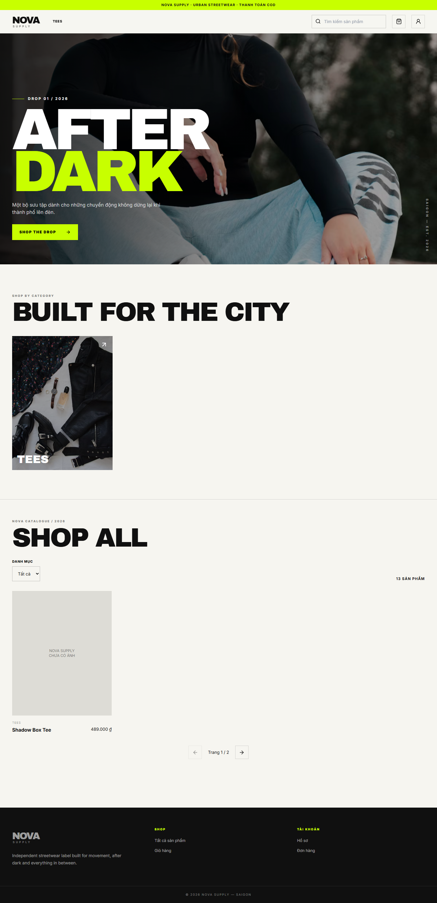
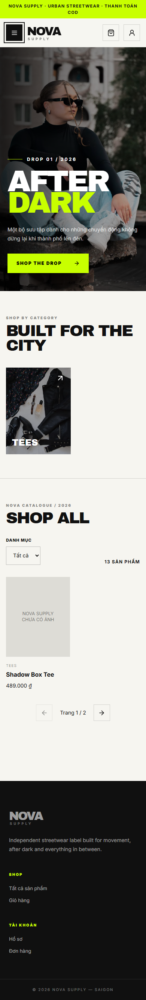

# Frontend

Yêu cầu Node.js `^22.13.0 || ^24.0.0 || >=26.0.0` và npm đi kèm Node.js.

Chạy các lệnh sau trong thư mục `frontend/`:

```sh
npm ci
npm run dev:portals
```

Khởi động NestJS API tại `http://localhost:3000` theo [hướng dẫn backend](../backend/README.md). Các cổng Vite chuyển tiếp yêu cầu API tới địa chỉ này.

| Cổng | Chạy riêng | URL trình duyệt |
| --- | --- | --- |
| User | `npm run dev:user` (hoặc `npm run dev`) | http://localhost:5173 |
| Management | `npm run dev:admin` | http://localhost:5175 — nhân viên: `/admin/employees` |

Management dùng chung một portal cho `admin` và `manager`. `manager` thấy các module vận hành; `admin` có thêm quản lý nhân viên. Frontend chỉ ẩn/khóa điều hướng theo vai trò; backend vẫn là nơi quyết định quyền truy cập.

`admin` còn có mục **Thống kê doanh thu** tại `http://localhost:5175/admin/revenue`. Trang gọi `GET /admin/reports/revenue?from=YYYY-MM-DD&to=YYYY-MM-DD`; mặc định là tháng lịch hiện tại theo múi giờ `Asia/Ho_Chi_Minh`. Báo cáo chỉ tính đơn đã thanh toán, chưa bị hủy, theo `paymentConfirmedAt` ở Việt Nam. Chỉ tiêu là tổng `totalAmount` sau giảm giá và gồm phí giao hàng; đây là báo cáo vận hành MVP nội bộ, không phải hóa đơn thuế hoặc báo cáo kế toán. `manager` không thấy mục này và không được backend cấp quyền API.

Cổng đã được sử dụng sẽ khiến lệnh khởi động thất bại; Vite không tự đổi sang cổng khác. Dừng cả hai bằng `Ctrl+C` khi chạy `dev:portals`.

## Kiểm tra và build

```sh
npm test -- --run
npm run test:smoke
npm run build
```

Smoke test dùng API giả cục bộ và các cổng tạm thời để kiểm tra HTML, đường dẫn sâu, bootstrap, proxy JSON và xung đột cổng; không cần NestJS hay cơ sở dữ liệu. Test này không kiểm tra thao tác trong trình duyệt hoặc API thật.

Build riêng: `npm run build:user`, `npm run build:admin`. Kết quả nằm trong `dist/user` và `dist/admin`.


## NOVA Supply — giao diện khách hàng

Portal User dùng thiết kế từ `Fashion E-commerce Purchase Page.zip`, giữ hero/editorial, Archivo Black/Inter, màu kem/đen/neon và bố cục responsive. Mã tích hợp nằm trong `src/nova/`; portal quản lý giữ nguyên luồng hiện có. Không sử dụng cấu hình Figma Make hoặc dữ liệu demo khi chạy ứng dụng.

- Catalog: `/store/categories`, `/store/products?q=&categoryId=&page=&limit=`; chi tiết `/store/products/:id`. Chỉ lọc theo danh mục/từ khóa, không suy diễn tồn kho hoặc sắp xếp giá trên từng trang.
- Ảnh lấy từ API. Có thể cấu hình ánh xạ **đúng sản phẩm** tại `src/nova/media.ts`; thiếu ảnh dùng placeholder. Hero và ảnh editorial chỉ trang trí, vẫn dùng URL Unsplash của mẫu; font tải từ Google Fonts.
- Giỏ chỉ lưu ID sản phẩm, ID biến thể, số lượng trong localStorage (`nova-cart-v2`), tối đa 100 biến thể. Khi mở giỏ/checkout, tải lại sản phẩm và giá; dòng lỗi chặn đặt hàng. Tiền tạm tính dùng BigInt theo đơn vị 0,01 đồng.
- Đăng ký/đăng nhập/hồ sơ qua `/auth/customer/*`. JWT chỉ nằm trong sessionStorage (`nova-token`), không đọc token nhân viên. 401 xóa phiên, giữ giỏ và chuyển đăng nhập đối với trang cần tài khoản.
- Checkout gửi recipientName, recipientPhone, shippingAddress, note, details, `paymentMethod: cod`, voucherCode tùy chọn tới `POST /orders`. Không gửi giá/tổng tiền client. Ship hiện tại 0; voucher chỉ được xác nhận khi tạo đơn, không hiển thị mức giảm giả.
- Lịch sử/chi tiết/hủy pending qua `/orders`. Tổng tiền và trạng thái từ server; nếu dòng đơn thiếu snapshot tên/size/màu thì dùng mã biến thể. Không thay bằng dữ liệu catalog mới.

### Proxy và triển khai

Sao chép `.env.example` thành `.env` nếu cần đổi `API_TARGET`. Vite User dùng tiền tố `/api`, bỏ tiền tố trước khi chuyển tới NestJS. Các proxy cũ vẫn phục vụ portal quản lý. `VITE_ADMIN_PORTAL_URL` và `VITE_USER_PORTAL_URL` cấu hình liên kết giữa hai portal (ví dụ https://admin.example.com và https://shop.example.com).

Production phục vụ `dist/user` ở root của domain cửa hàng; cấu hình reverse proxy `/api/` → NestJS `/` và SPA fallback về `/index.html` cho đường dẫn giao diện. Ví dụ Nginx trong server của User:

```nginx
location /api/ {
    proxy_pass http://127.0.0.1:3000/;
    proxy_cookie_path /auth/customer /api/auth/customer;
    proxy_set_header Host $host;
    proxy_set_header X-Forwarded-Proto $scheme;
}
location / {
    try_files $uri $uri/ /index.html;
}
```

Không fallback yêu cầu API sang HTML. Portal quản lý chạy trên domain riêng với các proxy hiện có; không gộp hai bản build vào cùng root. Không đặt khóa bí mật vào biến `VITE_*`.

### Giới hạn COD và xác minh

Backend chưa có idempotency cho COD. Giao diện khóa nút trong lúc gửi; timeout 25 giây, mất mạng hoặc lỗi 5xx **không tự gửi lại**. Khi kết quả chưa rõ, giữ giỏ và chặn gửi lại qua cả reload trong phiên trình duyệt, hướng khách kiểm tra lịch sử. Khách phải xác nhận chưa có đơn trước khi thử lại. Cơ chế này không bảo đảm chống trùng giữa nhiều tab/thiết bị; backend cần bổ sung idempotency trong phạm vi riêng. Chỉ xóa số lượng đã mua sau phản hồi thành công.

```sh
npm run typecheck
npm run lint:nova
npm test -- --run
npm run test:smoke
npx playwright install chromium
npm run test:e2e
npm run build
```

Playwright sử dụng API mô phỏng, chạy 1440×1000 và 390×844: tìm/lọc/phân trang, menu bàn phím, không tràn ngang, giỏ sau reload, đăng nhập quay lại checkout, voucher bị từ chối, COD thành công, hủy đơn, lỗi mạng không retry, phiên hết hạn và biến thể mất hiệu lực. Vitest kiểm tra tiền chính xác, dữ liệu giỏ và quyền sở hữu phiên. Smoke test kiểm tra các portal/proxy thật với API giả cục bộ.

**Chưa nghiệm thu PostgreSQL:** môi trường thực hiện không có TEST_DATABASE_URL và Docker daemon không hoạt động. Build/lint backend được chạy, nhưng các kiểm thử frontend mô phỏng không thay thế integration test với database riêng. Không chạy kiểm thử ghi dữ liệu trên database thật của cửa hàng.

Ảnh minh họa kiểm thử dùng fixture API (sản phẩm thiếu ảnh để kiểm tra placeholder), không phải dữ liệu bán hàng thật:




Main hiện có refresh cookie HttpOnly. NOVA vẫn theo phạm vi đã chốt: access JWT trong sessionStorage, 401 yêu cầu đăng nhập lại, không tự refresh/retry yêu cầu đặt hàng. Đăng xuất gọi `/auth/customer/logout` để thu hồi cookie và luôn xóa phiên local; nếu mất mạng, việc thu hồi server chưa được xác nhận. Reverse proxy cần đổi cookie path như ví dụ trên và backend production cần `AUTH_ALLOWED_ORIGINS` chứa origin HTTPS của cửa hàng. Áp dụng các migration sẵn có của main (bao gồm refresh sessions) trước khi chạy backend; PR này không thêm migration.
